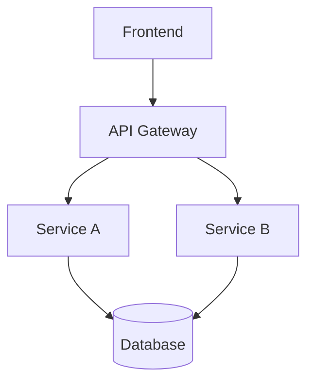

# Project Overview

This document describes the architecture of our sample project.

## Metadata

- **name**: SampleProject
- **version**: `1.0.0`
- **author**: dev-team

## Introduction

The project consists of several modules working together to provide a complete solution.

### Goals

- Provide clean API for data processing
- Generate visual reports automatically
- Support multiple output formats

### Non-Goals

- Real-time streaming (not supported yet)
- Mobile application (out of scope)

## Architecture



## Components

- **Frontend**: React-based web interface
- **API Gateway**: [nginx](https://nginx.org/) reverse proxy
- **Service A**: Core business logic
- **Service B**: Background processing
- **Database**: PostgreSQL

## Configuration

```yaml
# Basic config
server:
  port: 8080
  host: 0.0.0.0
database:
  url: postgresql://localhost/db
```

## Code Samples

```python
# main.py
def process_data(data):
    return [item.strip() for item in data]
```

```bash
# run.sh
#!/bin/bash
python -m uvicorn main:app --reload
```

## Related Documents

- See [API Reference](api_reference.md)
- See [Deployment Guide](deployment.md)
- Internal link: [Introduction](#introduction)

## Deployment

### Production

- Use Docker containers
- Set up monitoring with Prometheus
- Configure log aggregation

### Development

- Run locally with `docker-compose`
- Hot reload enabled by default
