# System Architecture Analysis

## Overview

- **Project**: /home/tom/github/semcod/mdflow
- **Primary Language**: python
- **Languages**: python: 14, md: 5, shell: 3, txt: 1, toml: 1
- **Analysis Mode**: static
- **Total Functions**: 103
- **Total Classes**: 25
- **Modules**: 25
- **Entry Points**: 91

## Architecture by Module

### SUMR
- **Functions**: 57
- **Classes**: 11
- **File**: `SUMR.md`

### mdflow
- **Functions**: 12
- **Classes**: 1
- **File**: `__init__.py`

### mdflow.generators.mermaid
- **Functions**: 9
- **File**: `mermaid.py`

### mdflow.parser
- **Functions**: 7
- **Classes**: 1
- **File**: `parser.py`

### mdflow.analyzers
- **Functions**: 7
- **Classes**: 4
- **File**: `__init__.py`

### mdflow.cli
- **Functions**: 4
- **File**: `cli.py`

### mdflow.generators.html
- **Functions**: 3
- **File**: `html.py`

### mdflow.models
- **Functions**: 2
- **Classes**: 8
- **File**: `models.py`

### README
- **Functions**: 1
- **File**: `README.md`

### examples.basic_usage
- **Functions**: 1
- **File**: `basic_usage.py`

### examples.advanced_analysis
- **Functions**: 1
- **File**: `advanced_analysis.py`

### mdflow.generators.markdown
- **Functions**: 1
- **File**: `markdown.py`

### examples.directory_scan
- **Functions**: 1
- **File**: `directory_scan.py`

### examples.custom_diagrams
- **Functions**: 1
- **File**: `custom_diagrams.py`

## Key Entry Points

Main execution flows into the system:

### examples.advanced_analysis.main
- **Calls**: MdFlow, flow.parse, README.print, README.print, README.print, flow.structure, README.print, README.print

### mdflow.parser.MdParser.parse_text
- **Calls**: raw.splitlines, enumerate, next, mdflow.parser._parse_metadata_section, MdDocument, self.FENCE_OPEN_RE.match, self.HEADING_RE.match, self.LINK_RE.finditer

### examples.custom_diagrams.main
- **Calls**: MdFlow, flow.parse, README.print, README.print, README.print, flow.diagrams, diagrams.items, README.print

### examples.directory_scan.main
- **Calls**: MdFlow, README.print, README.print, README.print, flow.parse_dir, README.print, README.print, README.print

### examples.basic_usage.main
- **Calls**: MdFlow, flow.parse, README.print, README.print, README.print, README.print, README.print, README.print

### mdflow.generators.mermaid.alerts_diagram
> Mermaid flowchart of TOON alerts and refactor recommendations.
- **Calls**: metrics.get, metrics.get, lines.append, lines.append, None.join, lines.append, lines.append, enumerate

### mdflow.cli.main
- **Calls**: argparse.ArgumentParser, parser.add_subparsers, sub.add_parser, p_analyze.add_argument, p_analyze.add_argument, p_analyze.add_argument, p_analyze.set_defaults, sub.add_parser

### mdflow.cli.cmd_analyze
- **Calls**: MdFlow, flow.parse, README.print, README.print, README.print, README.print, README.print, README.print

### mdflow.generators.mermaid.section_flowchart
> Mermaid flowchart showing sections with their code/link counts.
- **Calls**: enumerate, None.join, lines.append, mdflow.generators.mermaid._short_label, None.join, annotations.append, annotations.append, annotations.append

### mdflow.cli.cmd_diagram
- **Calls**: MdFlow, flow.parse, flow.diagrams, README.print, README.print, sys.exit, README.print, Path

### mdflow.generators.mermaid.dependency_diagram
> Mermaid flowchart of cross-document dependencies.
- **Calls**: None.join, mdflow.generators.mermaid._safe_id, lines.append, mdflow.generators.mermaid._safe_id, mdflow.generators.mermaid._safe_id, edge_kinds.get, node.endswith, mdflow.generators.mermaid._short_label

### mdflow.generators.mermaid.markpact_graph
> Mermaid graph of markpact embedded file references.
- **Calls**: mdflow.generators.mermaid._safe_id, lines.append, lines.append, None.items, None.join, enumerate, lines.append, lines.append

### mdflow.MdFlow.report
> Generate reports for a single document.

formats can include: "html", "md", "mermaid"
Default: all three.
- **Calls**: Path, out.mkdir, Path, mdflow.generators.html.generate_html_report, p.write_text, written.append, README.print, mdflow.generators.markdown.generate_markdown_report

### mdflow.MdFlow.scan
> Parse all .md files in a directory, generate reports, and build a
cross-document dependency graph report.
- **Calls**: self.parse_dir, README.print, Path, self.dependency_graph, mm.dependency_diagram, self.report, p.write_text, README.print

### mdflow.MdFlow.diagrams
> Return all diagrams as strings (keyed by name) without writing files.
Useful for embedding in other tools.
- **Calls**: self._struct.heading_tree, self._struct.section_summary, self._code_inv.inventory, self._toon.metrics, mm.heading_tree_diagram, mm.section_flowchart, mm.code_inventory_pie, mm.markpact_graph

### mdflow.generators.mermaid.workflow_diagram
> Extract workflow steps from DOQL/CSS code blocks and render as flowchart.
- **Calls**: re.compile, re.compile, wf_re.findall, None.join, mdflow.generators.mermaid._safe_id, lines.append, len, lines.append

### mdflow.analyzers.StructureAnalyzer.section_summary
> List of sections with code block count, link count, list item count.
- **Calls**: enumerate, sections.append, float, len, len, list, len, len

### mdflow.analyzers.ToonAnalyzer.metrics
- **Calls**: ts.name.upper, self.CC_RE.search, self.CRITICAL_RE.search, float, int, m.group, m.group, self._parse_health

### mdflow.analyzers.DependencyAnalyzer.build
- **Calls**: DependencyGraph, g.add_node, self._resolve_path, g.add_edge, g.add_edge, DependencyEdge, DependencyEdge

### mdflow.analyzers.CodeInventoryAnalyzer.inventory
- **Calls**: defaultdict, defaultdict, None.append, len, dict, dict, None.append

### mdflow.cli.cmd_scan
- **Calls**: MdFlow, flow.scan, README.print, args.format.split, len, len

### mdflow.MdFlow.parse_dir
> Parse all .md files in a directory tree.
- **Calls**: Path, sorted, root.rglob, docs.append, self._parser.parse, README.print

### mdflow.MdFlow._write_dep_graph_html
- **Calls**: None.replace, p.write_text, README.print, diagram.replace, len, len

### mdflow.analyzers.ToonAnalyzer._parse_health
- **Calls**: self.CC_RE.search, self.CRITICAL_RE.search, float, int, m.group, m.group

### mdflow.generators.mermaid.heading_tree_diagram
> Mermaid mindmap of heading hierarchy.
- **Calls**: _render, None.join, mdflow.generators.mermaid._short_label, lines.append, _render

### mdflow.MdFlow.__init__
- **Calls**: MdParser, DependencyAnalyzer, StructureAnalyzer, CodeInventoryAnalyzer, ToonAnalyzer

### mdflow.MdFlow._write_mermaid_files
- **Calls**: self.diagrams, diagrams.items, p.write_text, written.append, README.print

### mdflow.parser.MdParser.parse
- **Calls**: Path, path.read_text, self.parse_text, str

### mdflow.generators.mermaid.code_inventory_pie
> Mermaid pie chart of code blocks by language.
- **Calls**: None.items, None.join, lines.append, len

### mdflow.analyzers.StructureAnalyzer.heading_tree
> Return a nested tree of headings.
- **Calls**: stack.append, stack.pop, None.append, tree.append

## Process Flows

Key execution flows identified:

### Flow 1: main
```
main [examples.advanced_analysis]
  └─ →> print
  └─ →> print
```

### Flow 2: parse_text
```
parse_text [mdflow.parser.MdParser]
  └─ →> _parse_metadata_section
```

### Flow 3: alerts_diagram
```
alerts_diagram [mdflow.generators.mermaid]
```

### Flow 4: cmd_analyze
```
cmd_analyze [mdflow.cli]
  └─ →> print
  └─ →> print
```

### Flow 5: section_flowchart
```
section_flowchart [mdflow.generators.mermaid]
  └─> _short_label
```

### Flow 6: cmd_diagram
```
cmd_diagram [mdflow.cli]
  └─ →> print
  └─ →> print
```

### Flow 7: dependency_diagram
```
dependency_diagram [mdflow.generators.mermaid]
  └─> _safe_id
  └─> _safe_id
```

### Flow 8: markpact_graph
```
markpact_graph [mdflow.generators.mermaid]
  └─> _safe_id
```

### Flow 9: report
```
report [mdflow.MdFlow]
  └─ →> generate_html_report
      └─> _card
```

### Flow 10: scan
```
scan [mdflow.MdFlow]
  └─ →> print
```

## Key Classes

### mdflow.MdFlow
> High-level façade for the mdflow library.

Examples
--------
Single file:
    flow = MdFlow()
    do
- **Methods**: 12
- **Key Methods**: mdflow.MdFlow.__init__, mdflow.MdFlow.parse, mdflow.MdFlow.parse_dir, mdflow.MdFlow.dependency_graph, mdflow.MdFlow.structure, mdflow.MdFlow.code_inventory, mdflow.MdFlow.toon_metrics, mdflow.MdFlow.report, mdflow.MdFlow.scan, mdflow.MdFlow.diagrams

### mdflow.models.MdDocument
> Full parsed representation of one Markdown file.
- **Methods**: 4
- **Key Methods**: mdflow.models.MdDocument.internal_links, mdflow.models.MdDocument.anchor_links, mdflow.models.MdDocument.external_links, mdflow.models.MdDocument.markpact_blocks

### mdflow.parser.MdParser
> Parse a single Markdown file into an MdDocument.
- **Methods**: 2
- **Key Methods**: mdflow.parser.MdParser.parse, mdflow.parser.MdParser.parse_text

### mdflow.analyzers.DependencyAnalyzer
> Build a cross-document dependency graph from a list of MdDocuments.
- **Methods**: 2
- **Key Methods**: mdflow.analyzers.DependencyAnalyzer.build, mdflow.analyzers.DependencyAnalyzer._resolve_path

### mdflow.analyzers.StructureAnalyzer
> Analyse the heading/section structure of a single document.
- **Methods**: 2
- **Key Methods**: mdflow.analyzers.StructureAnalyzer.heading_tree, mdflow.analyzers.StructureAnalyzer.section_summary

### mdflow.analyzers.ToonAnalyzer
> Extract structured metrics from embedded TOON sections.
- **Methods**: 2
- **Key Methods**: mdflow.analyzers.ToonAnalyzer.metrics, mdflow.analyzers.ToonAnalyzer._parse_health

### mdflow.models.DependencyGraph
- **Methods**: 2
- **Key Methods**: mdflow.models.DependencyGraph.add_node, mdflow.models.DependencyGraph.add_edge

### mdflow.analyzers.CodeInventoryAnalyzer
> Inventory all code blocks by language, markpact type, and path.
- **Methods**: 1
- **Key Methods**: mdflow.analyzers.CodeInventoryAnalyzer.inventory

### SUMR.HistoryEvent
- **Methods**: 0

### SUMR.HistoryWriter
- **Methods**: 0

### SUMR.HistoryReader
- **Methods**: 0

### SUMR.ConsciousnessLoop
- **Methods**: 0

### SUMR.LLMConfig
- **Methods**: 0

### SUMR.MemoryConfig
- **Methods**: 0

### SUMR.AnalyzerConfig
- **Methods**: 0

### SUMR.RefactorConfig
- **Methods**: 0

### SUMR.AgentConfig
- **Methods**: 0

### SUMR.CycleReport
- **Methods**: 0

### SUMR.RefactorOrchestrator
- **Methods**: 0

### mdflow.models.Heading
- **Methods**: 0

## Data Transformation Functions

Key functions that process and transform data:

### SUMR._format_event_header

### SUMR._format_event_details

### mdflow.parser._parse_fence_info
> Parse fence info string like:
  python
  toon markpact:analysis path=project/evolution.toon.yaml
  c
- **Output to**: None.split, part.startswith, info.strip, part.split, part.split

### mdflow.parser._parse_toon_content
> Lightly parse TOON format embedded in code blocks.
- **Output to**: content.splitlines, _TOON_SECTION_RE.match, sections.append, m.group, _TOON_ITEM_RE.match

### mdflow.parser._parse_metadata_section
> Extract key/value pairs from a ## Metadata list section.
- **Output to**: text.splitlines, re.match, re.match, _META_ITEM_RE.match, None.strip

### mdflow.parser.MdParser.parse
- **Output to**: Path, path.read_text, self.parse_text, str

### mdflow.parser.MdParser.parse_text
- **Output to**: raw.splitlines, enumerate, next, mdflow.parser._parse_metadata_section, MdDocument

### mdflow.MdFlow.parse
> Parse a single Markdown file into an MdDocument.
- **Output to**: self._parser.parse, Path

### mdflow.MdFlow.parse_dir
> Parse all .md files in a directory tree.
- **Output to**: Path, sorted, root.rglob, docs.append, self._parser.parse

### mdflow.analyzers.ToonAnalyzer._parse_health
- **Output to**: self.CC_RE.search, self.CRITICAL_RE.search, float, int, m.group

## Public API Surface

Functions exposed as public API (no underscore prefix):

- `examples.advanced_analysis.main` - 57 calls
- `mdflow.generators.html.generate_html_report` - 54 calls
- `mdflow.parser.MdParser.parse_text` - 40 calls
- `examples.custom_diagrams.main` - 40 calls
- `examples.directory_scan.main` - 39 calls
- `examples.basic_usage.main` - 35 calls
- `mdflow.generators.markdown.generate_markdown_report` - 33 calls
- `mdflow.generators.mermaid.alerts_diagram` - 19 calls
- `mdflow.cli.main` - 19 calls
- `mdflow.cli.cmd_analyze` - 17 calls
- `mdflow.generators.mermaid.section_flowchart` - 14 calls
- `mdflow.cli.cmd_diagram` - 13 calls
- `mdflow.generators.mermaid.dependency_diagram` - 12 calls
- `mdflow.generators.mermaid.markpact_graph` - 12 calls
- `mdflow.MdFlow.report` - 12 calls
- `mdflow.MdFlow.scan` - 10 calls
- `mdflow.MdFlow.diagrams` - 10 calls
- `mdflow.generators.mermaid.workflow_diagram` - 9 calls
- `mdflow.analyzers.StructureAnalyzer.section_summary` - 8 calls
- `mdflow.analyzers.ToonAnalyzer.metrics` - 8 calls
- `mdflow.analyzers.DependencyAnalyzer.build` - 7 calls
- `mdflow.analyzers.CodeInventoryAnalyzer.inventory` - 7 calls
- `mdflow.cli.cmd_scan` - 6 calls
- `mdflow.MdFlow.parse_dir` - 6 calls
- `mdflow.generators.mermaid.heading_tree_diagram` - 5 calls
- `mdflow.parser.MdParser.parse` - 4 calls
- `mdflow.generators.mermaid.code_inventory_pie` - 4 calls
- `mdflow.analyzers.StructureAnalyzer.heading_tree` - 4 calls
- `mdflow.models.DependencyGraph.add_edge` - 3 calls
- `mdflow.MdFlow.parse` - 2 calls
- `mdflow.MdFlow.structure` - 2 calls
- `mdflow.MdFlow.dependency_graph` - 1 calls
- `mdflow.MdFlow.code_inventory` - 1 calls
- `mdflow.MdFlow.toon_metrics` - 1 calls
- `mdflow.models.DependencyGraph.add_node` - 1 calls
- `README.print` - 0 calls
- `SUMR.cmd_analyze` - 0 calls
- `SUMR.cmd_explain` - 0 calls
- `SUMR.cmd_refactor` - 0 calls
- `SUMR.cmd_memory_stats` - 0 calls

## System Interactions

How components interact:

```mermaid
graph TD
    main --> MdFlow
    main --> parse
    main --> print
    parse_text --> splitlines
    parse_text --> enumerate
    parse_text --> next
    parse_text --> _parse_metadata_sect
    parse_text --> MdDocument
    main --> parse_dir
    alerts_diagram --> get
    alerts_diagram --> append
    alerts_diagram --> join
    main --> ArgumentParser
    main --> add_subparsers
    main --> add_parser
    main --> add_argument
    cmd_analyze --> MdFlow
    cmd_analyze --> parse
    cmd_analyze --> print
    section_flowchart --> enumerate
    section_flowchart --> join
    section_flowchart --> append
    section_flowchart --> _short_label
    cmd_diagram --> MdFlow
    cmd_diagram --> parse
    cmd_diagram --> diagrams
    cmd_diagram --> print
    dependency_diagram --> join
    dependency_diagram --> _safe_id
    dependency_diagram --> append
```



## Reverse Engineering Guidelines

1. **Entry Points**: Start analysis from the entry points listed above
2. **Core Logic**: Focus on classes with many methods
3. **Data Flow**: Follow data transformation functions
4. **Process Flows**: Use the flow diagrams for execution paths
5. **API Surface**: Public API functions reveal the interface

## Context for LLM

Maintain the identified architectural patterns and public API surface when suggesting changes.